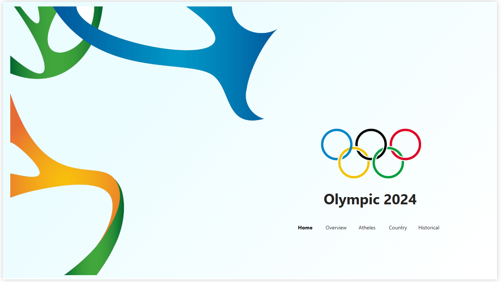
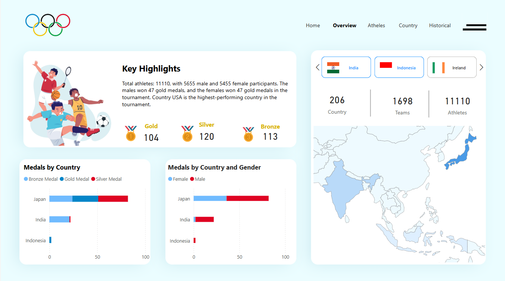
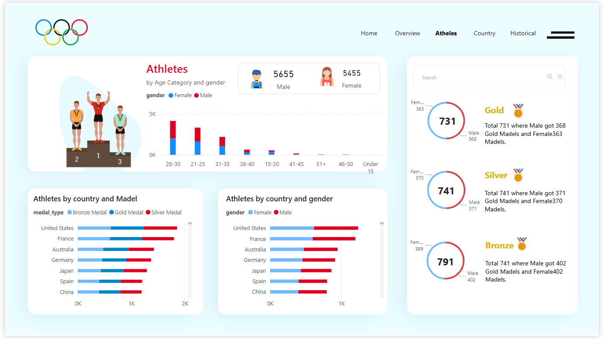
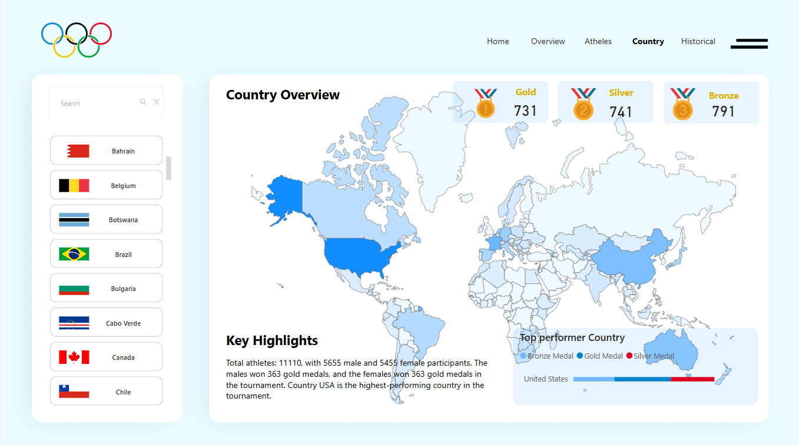
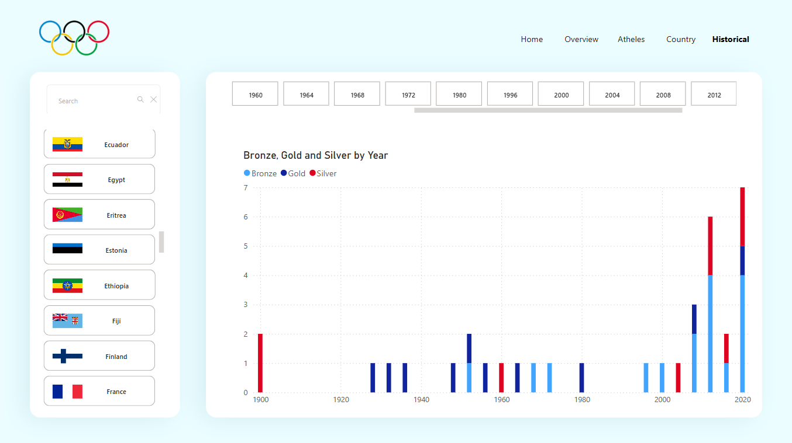

# 🏅 Olympic 2024 Power BI Dashboard

## Uncover the Story Behind the Games

Step into the Olympic 2024 Dashboard—where data comes alive and every chart tells a story. This isn’t just about numbers; it’s about capturing the spirit of the Games through the journeys of athletes, the pride of nations, and the moments that make history. Explore the pulse of the world’s greatest sporting event—one insight at a time.

---

## 📜 Our Journey Begins: Home

Welcome to the starting line of your Olympic adventure. Imagine the roar of the crowd, the flash of flags, and the iconic Olympic rings towering above—this is where it all begins. The Home page sets the tone for your journey through the data-driven world of the 2024 Games.

- **Olympic Theme & Logo**: A visual tribute to the passion, unity, and spirit of the Games—designed to immerse you in the Olympic atmosphere.

- **Dashboard Title**: Olympic 2024 Dashboard—your front-row seat to understanding the stories behind the stats.

- **Creator’s Signature**: Thoughtfully crafted by Bansir Chovatiya, this dashboard brings the thrill of the Olympics to life through the lens of data.

- **Navigation Menu**: Your compass through the Games—seamlessly explore the Overview, Athletes, Countries, and Historic pages to uncover insights and trends.

  **Let the games—and the data—begin!** 🏅
  

---

## 🌍 Big Picture First: Overview

Before we dive into the details, let’s zoom out and take a look at the broader landscape. The **Overview** page acts as your Olympic command center—offering a concise snapshot of the action unfolding across the Games.

- **Key Highlights**: Get up to speed with a quick glance:
  - Total number of athletes competing on the world stage
  - Nations participating, each bringing their champions
  - Count of events and sports celebrating peak human performance
  - Medal tally—who’s claiming Gold, Silver, and Bronze?

- **Key Metric Cards**: Your go-to quick stats:

  - Medal Counts by Type: A quick glance at Gold, Silver, and Bronze winners
  - Number of Countries: Global unity in action
  - Total Athletes: Honoring every participant
  - Event Count: A full scope of all competitions

- **Visuals That Speak**:
  - **Stacked Bar Charts**:

    -**Medals by Country**: Compare nations and see who leads the pack
    -**Medals by Gender**: Highlighting the achievements of both male and female athletes
    -**Shape Map**: A world map spotlighting medal-winning countries—visualizing Olympic triumphs across the globe
    -**Country Slicer**: Want to explore one country’s journey? Use this slicer to focus on their performance
 -**Get ready to explore the Games like never before—through data that tells the real story behind the spectacle**.

    

 ---

 ## 🏃 Meet the Heroes: Athletes

Every athlete has a story—of dedication, perseverance, and triumph. The **Athletes** page is where we celebrate these individual stories:

- **Column Chart**: Athletes by age category and gender. Here, you see the faces behind the numbers—young stars and seasoned champions, all united by their love of sport.
- **Stacked Bar Charts**:
  - By Country and Gender: Discover which nations have the strongest teams, broken down by gender.
  - By Country and Medal Type: See how different countries excel in various sports.
- **Donut Charts**: Visualize the distribution of Gold, Silver, and Bronze medals by gender. A colorful display of achievement and equality.

---

## 🌍 A World United: Country

The Olympics bring together people from all corners of the globe. The **Country** page is a celebration of this unity:

- **World Shape Map**: A stunning visual of the world, highlighting each participating country. This isn’t just a map; it’s a tapestry of cultures, all competing in the spirit of friendly competition.
- **Country Slicer**: Curious about how your home country is doing? Use the slicer to explore detailed stats and find out.

---

## 📅 Reliving the Glory Days: Historic

The Olympics have a rich history of unforgettable moments. The **Historic** page lets you walk down memory lane:

- **Stacked Column Chart**: Gold, Silver, and Bronze medals by year. See how the competition has evolved over time and how different eras brought different champions to the fore.
- **Country Slicer**: Focus on the historical achievements of specific nations and discover trends and legends that have shaped the Olympics.

---
